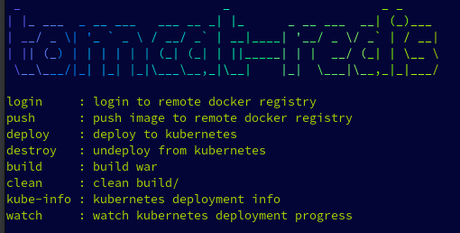

#                                                  

##### This project shows how to configure a simple servlet to run on Tomcat in Kubernetes with distributed session replication and JCache implemented by Redis.

###### Tested configurations:
 - [src/main/resources/redisson-jcache.yaml](src/main/resources/redisson-jcache.yaml)
  
This is the servlet JCache implementation configuration file, it is configured to look for the redis server at hostname="redis"


 - [conf/context.xml](conf/context.xml)
 - [conf/redisson.yaml](conf/redisson.yaml)

This is the configuration for Tomcat session replication using the Redis server, it is configured to look for the redis server at hostname="redis"

#### Running make will list build targets

- DOCKER_REGISTRY 

Define environment variable $DOCKER_REGISTRY for the container registry used.

###### Local testing/Cluster testing tools
- [redis-ephemeral.sh](redis-ephemeral.sh)

This runs a local Redis server for development testing

- [cli.newsession](cli.newsession)
  
This calls the server at $TARGET (default localhost) to create a new session

- [cli](cli)

After a session is created, this call the server at $TARGET (default localhost) to continue to use the session created previously.


###### Sample output:
```json
~/tomcat-redis(main) $ ./cli.newsession 
calling 10.2.2.150
HTTP/1.1 200 OK
Content-Length: 98
Date: Wed, 31 May 2023 02:22:38 GMT
Set-Cookie: JSESSIONID=1E0A661555D17E1B9000D4DE27A91812; Path=/; HttpOnly
Content-Type: text/plain; charset=utf-8

{"count":0,"localName":"10.42.3.20","localName":"10.42.3.20","localPort":"8080","cachedEntry":"1"}
~/tomcat-redis(main) $ ./cli
calling 10.2.2.150
# Netscape HTTP Cookie File
# https://curl.se/docs/http-cookies.html
# This file was generated by libcurl! Edit at your own risk.

#HttpOnly_10.2.2.150	FALSE	/	FALSE	0	JSESSIONID	1E0A661555D17E1B9000D4DE27A91812
HTTP/1.1 200 OK
Content-Length: 98
Date: Wed, 31 May 2023 02:22:43 GMT
Content-Type: text/plain; charset=utf-8

{"count":1,"localName":"10.42.1.19","localName":"10.42.1.19","localPort":"8080","cachedEntry":"2"}
~/tomcat-redis(main) $ ./cli
calling 10.2.2.150
# Netscape HTTP Cookie File
# https://curl.se/docs/http-cookies.html
# This file was generated by libcurl! Edit at your own risk.

#HttpOnly_10.2.2.150	FALSE	/	FALSE	0	JSESSIONID	1E0A661555D17E1B9000D4DE27A91812
HTTP/1.1 200 OK
Content-Length: 98
Date: Wed, 31 May 2023 02:22:47 GMT
Content-Type: text/plain; charset=utf-8

{"count":2,"localName":"10.42.2.19","localName":"10.42.2.19","localPort":"8080","cachedEntry":"3"}
~/tomcat-redis(main) $ ./cli
calling 10.2.2.150
# Netscape HTTP Cookie File
# https://curl.se/docs/http-cookies.html
# This file was generated by libcurl! Edit at your own risk.

#HttpOnly_10.2.2.150	FALSE	/	FALSE	0	JSESSIONID	1E0A661555D17E1B9000D4DE27A91812
HTTP/1.1 200 OK
Content-Length: 98
Date: Wed, 31 May 2023 02:22:48 GMT
Content-Type: text/plain; charset=utf-8

{"count":3,"localName":"10.42.3.20","localName":"10.42.3.20","localPort":"8080","cachedEntry":"4"}
~/tomcat-redis(main) $ ./cli
calling 10.2.2.150
# Netscape HTTP Cookie File
# https://curl.se/docs/http-cookies.html
# This file was generated by libcurl! Edit at your own risk.

#HttpOnly_10.2.2.150	FALSE	/	FALSE	0	JSESSIONID	1E0A661555D17E1B9000D4DE27A91812
HTTP/1.1 200 OK
Content-Length: 98
Date: Wed, 31 May 2023 02:22:50 GMT
Content-Type: text/plain; charset=utf-8

{"count":4,"localName":"10.42.1.19","localName":"10.42.1.19","localPort":"8080","cachedEntry":"5"}
~/tomcat-redis(main) $ ./cli
calling 10.2.2.150
# Netscape HTTP Cookie File
# https://curl.se/docs/http-cookies.html
# This file was generated by libcurl! Edit at your own risk.

#HttpOnly_10.2.2.150	FALSE	/	FALSE	0	JSESSIONID	1E0A661555D17E1B9000D4DE27A91812
HTTP/1.1 200 OK
Content-Length: 98
Date: Wed, 31 May 2023 02:22:53 GMT
Content-Type: text/plain; charset=utf-8

{"count":5,"localName":"10.42.2.19","localName":"10.42.2.19","localPort":"8080","cachedEntry":"6"}

```
